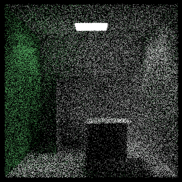

Rust raytracer
===
Reference
---
[_Ray Tracing in One Weekend_](https://raytracing.github.io/books/RayTracingInOneWeekend.html)
  
[_Ray Tracing: The Next Week_](https://raytracing.github.io/books/RayTracingTheNextWeek.html)
  
[_Ray Tracing: The Rest of Your Life_](https://raytracing.github.io/books/RayTracingTheRestOfYourLife.html)

Description
---
The Rust Version of Ray Tracing One Weekend

Difference
---
PBR Style Linear BVH and Intersection

Result
---
